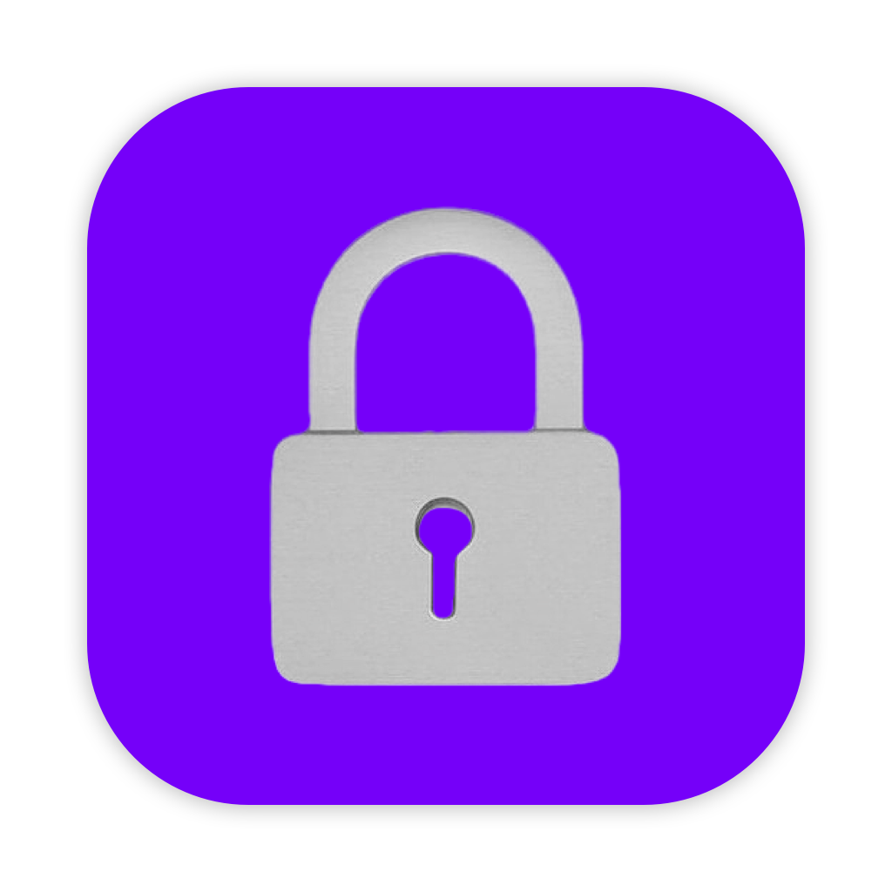
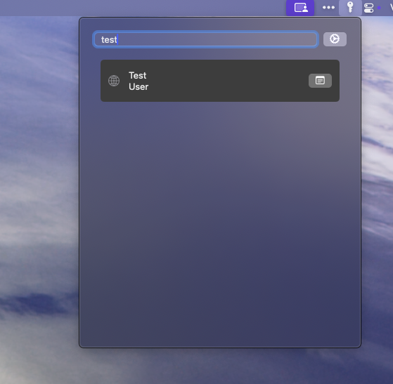
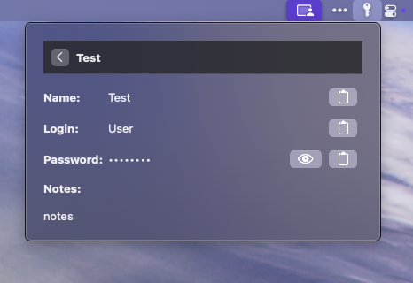

 
 <h1>Wenigwarden</h1>
 

  <b>Light macos Bitwarden client in the menu bar</b>
 

A lightweight **macOS menu bar client** for **Bitwarden** password manager, focused on essential vault access through the menu bar. This is a simplified alternative to the official desktop app.

**Wenigwarden** is designed for users who primarily need read-only access to their vault through a lightweight interface. Perfect for quick password lookups while consuming minimal system resources, with added convenience of keyboard shortcuts for power users.

_Note: This is an unofficial client and is not affiliated with Bitwarden Inc._

## Features

✅ **Supported**:

- **Menu Bar Integration**: Quick access to your passwords
- **Basic Vault Access**: View and copy credentials
- **Auto-Lock**: Basic timeout security
- **Minimal Resource Usage**: Tiny memory footprint
- **File Attachments**: View and download attached files
- **Keyboard Shortcuts**: Customizable hotkeys for quick access
- **Global Search**: Find entries quickly with keyboard navigation

❌ **Not Supported**:

- Password generator
- Vault management (add/edit/delete)
- Organizations
- Password sharing

## Important Note About Security

The app is **not signed** with an Apple developer certificate. When first launching the app, you'll need to:

1. Right-click (or Control-click) the app
2. Select "Open" from the context menu
3. Allow the app in **System Settings** → **Privacy & Security**

This only needs to be done once after installation.

## Screenshot

